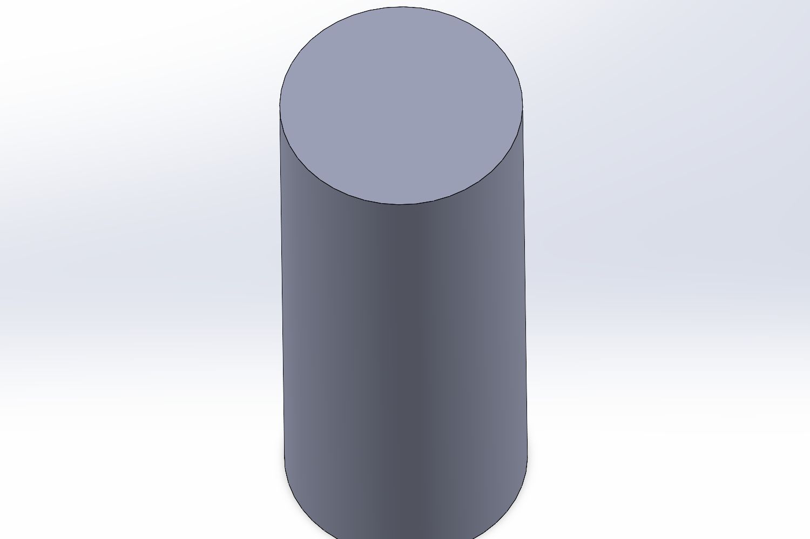
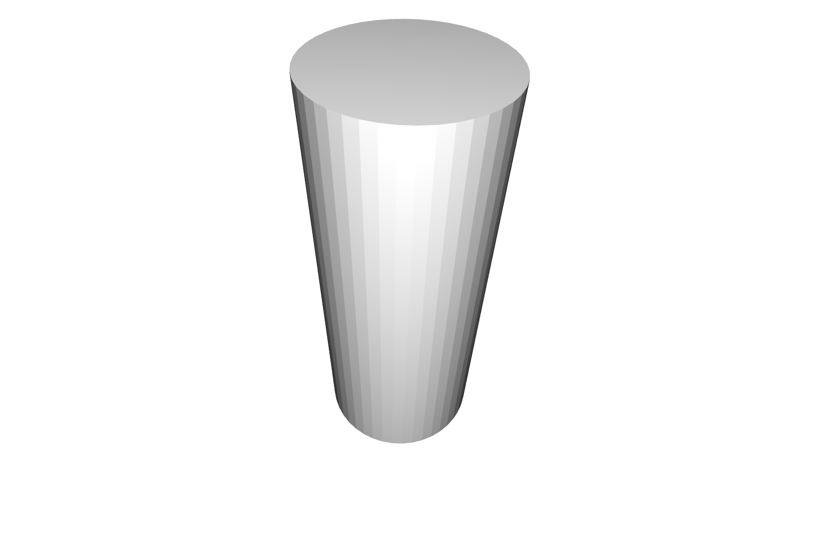
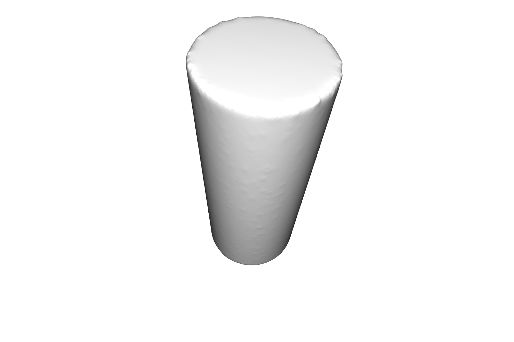

# STL file reader and smoother

This repository contains code for processing and smoothing of `.stl` file outputs of Computer Aided Design (CAD) 
software outputs to make them smoother for 3D printing.

## Context
Many CAD software, such as SOLIDWORKS&trade; and FUSION360, can generate `stl` files, which can be used to generate 
GCode for 3D printing. However, even with the most fine settings, some round features on these CAD designs turn out 
rough and not uniformly round due to the small amount of mesh points in the output.

<div style="display:flex">
     <div style="flex:1;padding-right:10px;">
          
     </div>
     <div style="flex:1;padding-left:10px;">
          
     </div>
</div>

This program takes these `.sty` files and performs the following operations on them to smooth the objects out for better 
3D prints:
1. Uniformly sample points from the mesh to generate a point cloud with 100 times more points for better detail
2. Using Poisson construction, construct a mesh surface from the point cloud with more points
3. Use Laplacian filtering to smooth out the resulting point cloud.

The resulting image looks like the following:


## Usage
If you do not have `open3d-python` and `numpy` installed, install it using:
```commandline
pip install numpy open3d-python
```


